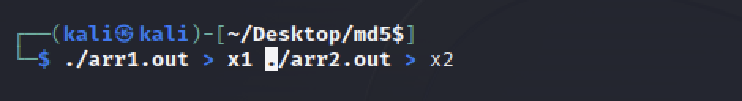
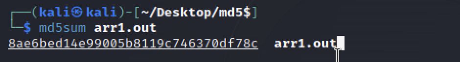
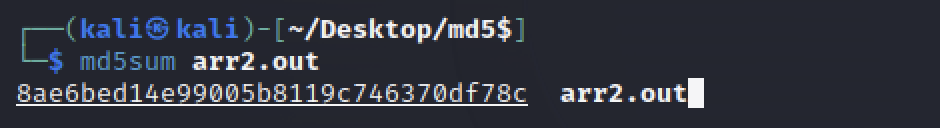
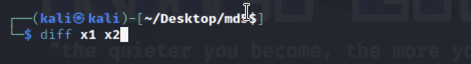
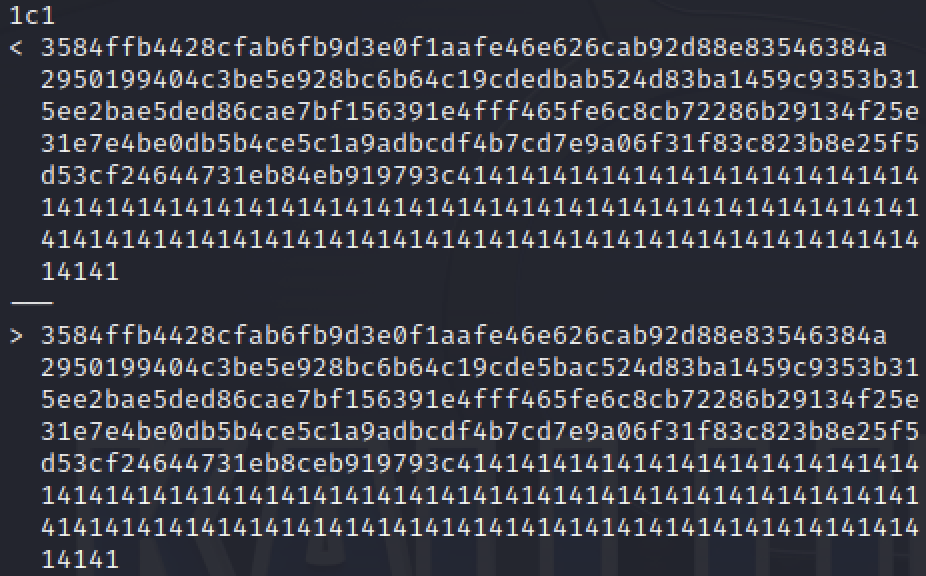
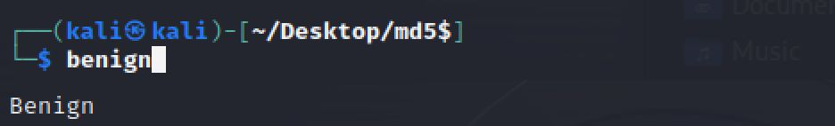
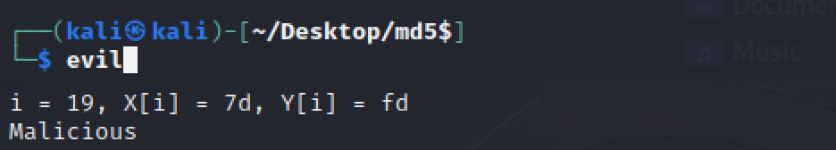
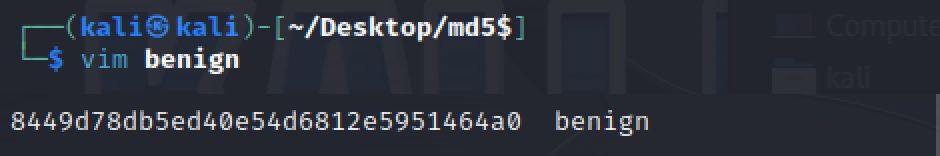
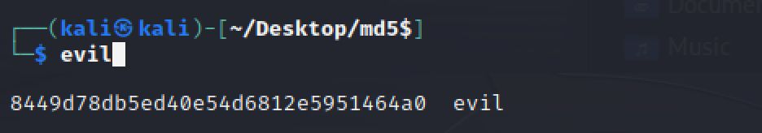

# seed -MD5-Collision-Attack
---
title: MD5 Collision Attack Lab

author: jiang jiayan

date: 21/01/2025

---

Instruction: https://seedsecuritylabs.org/Labs_16.04/PDF/Crypto_MD5_Collision.pdf


# Task 1

Générer un fichier prefix.txt contenant 64 caractères '9' :

```
python3 -c "print('9'*64,end='')" > prefix.txt
ls -ld prefix.txt
```

Créer deux fichiers avec la même empreinte MD5 :

```
md5collgen -p prefix.txt -o out1.bin out2.bin
```

Attendez quelques secondes et vérifiez si les fichiers sont différents :

```
$ diff out1.bin out2.bin
Binary files out1.bin and out2.bin differ
```

Vérifiez si leurs valeurs MD5 sont identiques :

```
$ md5sum out1.bin
b3d3a557001d81af72250f58b1cea4aa  out1.bin
$ md5sum out2.bin
b3d3a557001d81af72250f58b1cea4aa  out2.bin
```

3. Comparer leurs différences :

```
$ hexdump out1.bin > hex1
$ hexdump out2.bin > hex2
$ diff hex1 hex2
4,6c4,6
< 0000050 3d59 83f8 861b 0b01 523e 813f a5f3 9c8c
< 0000060 0412 b9f9 0e70 0fbd 508b 4256 a7ee 3f38
< 0000070 d438 668f 4abb ed3e 9003 ab89 a859 58bd
---
> 0000050 3d59 03f8 861b 0b01 523e 813f a5f3 9c8c
> 0000060 0412 b9f9 0e70 0fbd 508b 4256 27ee 3f39
> 0000070 d438 668f 4abb ed3e 9003 2b89 a859 58bd
8,10c8,10
< 0000090 7dac 713e e61b 6a1e 1acb 3d6e 86ec e602
< 00000a0 7c98 5b26 ca06 3fde 4c8a 973c 2450 28ea
< 00000b0 f128 b84a 6c42 0ac2 db2d 0427 baa5 93b1
---
> 0000090 7dac f13e e61b 6a1e 1acb 3d6e 86ec e602
> 00000a0 7c98 5b26 ca06 3fde 4c8a 973c a450 28e9
> 00000b0 f128 b84a 6c42 0ac2 db2d 8427 baa5 93b1
```

Utilisez le script diff_bytes.py pour identifier les différences dans les 128 derniers octets :

```
head -c 128 out1.bin > P
head -c 128 out2.bin > Q
diff_bytes.py P Q
```

Résultat :

```
different bytes in 0x53 :  0x2c vs 0xac
different bytes in 0x6d :  0xb4 vs 0x34
different bytes in 0x6e :  0x96 vs 0x97
different bytes in 0x7b :  0x77 vs 0xf7
```

Nous faisons en sorte que le contenu de `prefix.txt` soit `'9'*27`. Lors de l'utilisation :

```
md5collgen -p prefix.txt -o out1.bin out2.bin
```

Il produit également 2 fichiers de sortie avec 192 octets, ce qui signifie que le préfixe est complété par un multiple de 64. (il s'agit ici de 64 lui-même.) Vérifiez-le en

```
head -c 64 out1.bin | hexdump
```

Nous pouvons voir que la fin est complétée par 0, ce qui apparaît comme un caractère vide s'il est imprimé.

# Task 2 Génération de nouveaux fichiers avec un suffixe

Vérifier les empreintes MD5 des 128 derniers octets :

```
tail -c 128 out1.bin > P
tail -c 128 out2.bin > Q
```

Vérifiez si P et Q ont les mêmes valeurs de hachage MD5 :

```
$ md5sum P
7553683527861d35d134ffde7863ec62  P
$ md5sum Q
9eff026b6557922e812d4d31240b236d  Q
```

Créer un nouveau suffixe :

```
python3 -c "print('114514'*10,end='')" > suffix.txt
```

Concaténer 2 fichiers qui ont le même MD5 avec des suffixes pour générer 2 nouveaux fichiers :

```
cat out1.bin suffix > s1.out
cat out2.bin suffix > s2.out
```

Leurs valeurs MD5 sont exactement les mêmes :

```
$ md5sum s1.out
c4b50342bd2b771bfa696549d3dd0198  s1.out
$ md5sum s2.out
c4b50342bd2b771bfa696549d3dd0198  s2.out
```


# Task 3 Création de binaires exécutables manipulant les collisions MD5

 Initialiser un tableau `xyz` contenant des `'A'*200`:

```c
#include <stdio.h>
unsigned char xyz[200] = {
    "AAAAAAAAAAAAAAAAAAAAAAAAAAAAAAAAAAAAAAAAAAAAAAAAAA"
    "AAAAAAAAAAAAAAAAAAAAAAAAAAAAAAAAAAAAAAAAAAAAAAAAAA"
    "AAAAAAAAAAAAAAAAAAAAAAAAAAAAAAAAAAAAAAAAAAAAAAAAAA"
    "AAAAAAAAAAAAAAAAAAAAAAAAAAAAAAAAAAAAAAAAAAAAAAAAAA"};
int main()
{
    int i;
    for (i = 0; i < 200; i++)
    {
        printf("%x", xyz[i]);
    }
    printf("\n");
}
```

Compile [`print_array.c`](./print_array.c)  et examiner l’exécutable


```
gcc print_array.c -o print_array
bless print_array
```

Cela commence à partir du décalage : `0x1040`. Étant donné que `0x1040` (4160 en décimal) peut être divisé par 64, nous pouvons utiliser les premiers octets de `0x1040` comme préfixe et générer 128 octets pour remplir le contenu de `xyz`.

Tout d'abord, nous tronquons le préfixe et le suffixe (à partir du décalage : 4160+128) du fichier :

```
head -c 4160 print_array > prefix
tail -c +4288  print_array > suffix
```

Générer 2 fichiers avec `préfix` :

```
md5collgen -p prefix -o P Q
```

Ajoutez  `suffix` pour les rendre comme des programmes normaux :

```
cat P suffix > arr1.out
cat Q suffix > arr2.out
```

Rendez-les exécutables :

```
chmod u+x arr1.out arr2.out
```

Vérifier:







# Task 4 Exécution d’un binaire avec comportement malveillant et bénin identique


```c
#include <stdio.h>
#define LEN 300

unsigned char X[LEN] = {
    "AAAAAAAAAAAAAAAAAAAAAAAAAAAAAAAAAAAAAAAAAAAAAAAAAA"
    "AAAAAAAAAAAAAAAAAAAAAAAAAAAAAAAAAAAAAAAAAAAAAAAAAA"
    "AAAAAAAAAAAAAAAAAAAAAAAAAAAAAAAAAAAAAAAAAAAAAAAAAA"
    "AAAAAAAAAAAAAAAAAAAAAAAAAAAAAAAAAAAAAAAAAAAAAAAAAA"
    "AAAAAAAAAAAAAAAAAAAAAAAAAAAAAAAAAAAAAAAAAAAAAAAAAA"
    "AAAAAAAAAAAAAAAAAAAAAAAAAAAAAAAAAAAAAAAAAAAAAAAAAA"};

unsigned char Y[LEN] = {
    "AAAAAAAAAAAAAAAAAAAAAAAAAAAAAAAAAAAAAAAAAAAAAAAAAA"
    "AAAAAAAAAAAAAAAAAAAAAAAAAAAAAAAAAAAAAAAAAAAAAAAAAA"
    "AAAAAAAAAAAAAAAAAAAAAAAAAAAAAAAAAAAAAAAAAAAAAAAAAA"
    "AAAAAAAAAAAAAAAAAAAAAAAAAAAAAAAAAAAAAAAAAAAAAAAAAA"
    "AAAAAAAAAAAAAAAAAAAAAAAAAAAAAAAAAAAAAAAAAAAAAAAAAA"
    "AAAAAAAAAAAAAAAAAAAAAAAAAAAAAAAAAAAAAAAAAAAAAAAAAA"};

int main()
{
    for (int i = 0; i < LEN; i++)
    {
        if (X[i] != Y[i])
        {
            printf("i = %d, X[i] = %.2x, Y[i] = %.2x\n", i, X[i], Y[i]);
            printf("Malicious\n");
            return 0;
        }
    }
    printf("Benign\n");
    return 0;
}
```

Compile [`benign_evil.c`](./benign_evil.c)

```
gcc benign_evil.c -o benign_evil
```

Trouver où les tableaux `X`  et  `Y` commencent (des `0x41`continus se produisent) :

```
bless benign_evil
```

`X` démarre à partir du décalage `0x1040` et `Y` démarre à partir du décalage `0x1180`.

Obtenez le `prefix` et le `suffix` à partir de `benign_evil` :

```
head -c 4160 benign_evil > prefix
tail -c +4288 benign_evil > suffix
```

```
md5collgen -p prefix -o s1 s2
```

```
tail -c 128 s1 > P
tail -c 128 s2 > Q
```

`Y` commence à partir de `0xC1`(193) dans `suffix`, donc si nous voulons que `X=Y`, nous devons remplacer le décalage [193,321) par le même P ou Q généré ci-dessus :

```
head -c 192 suffix > suffix_pre
tail -c +320 suffix > suffix_post
```

Construisez les programmes exécutables finaux et rendez-les exécutables :

```
cat s1 suffix_pre P suffix_post > benign
cat s2 suffix_pre P suffix_post > evil
chmod u+x benign evil
```
Ils ont le même MD5 mais exécutent des comportements très différents :






